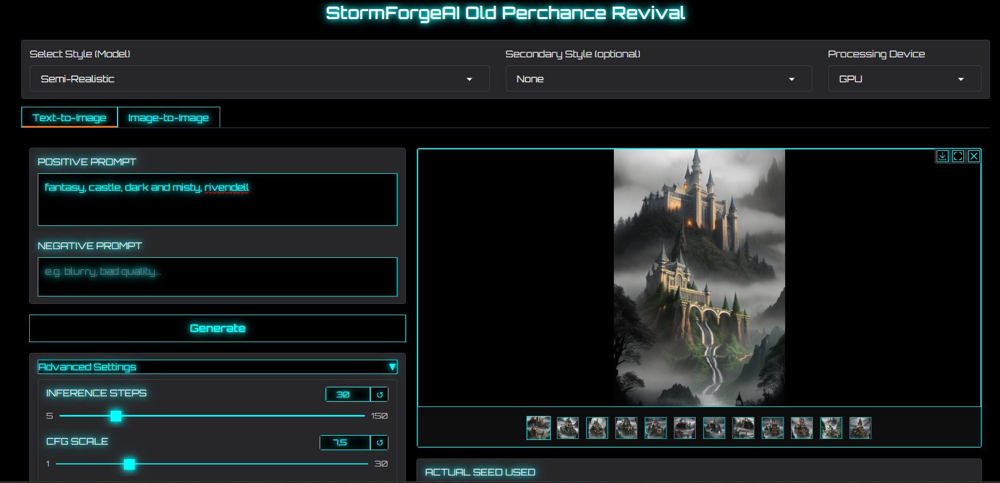

Perchance Revival - Einfache lokale SD 1.5 Bildgenerierung
==========================================================

⚠️ Experimentell & UNGETESTET ⚠️ AMD- und GTX-Fixpacks verfügbar auf Discord: https://discord.gg/SYEvvnTt  
-----------------------------

Willkommen bei **Perchance Revival**!  
Dies ist eine benutzerfreundliche Gradio-Webanwendung, die das Erlebnis des alten Perchance-Bildgenerators zurückbringt – mit den spezifischen Stable Diffusion 1.5-Modellen und den typischen Generierungsparametern/-Voreinstellungen, die dort verwendet wurden.

Erstelle mühelos und kostenlos Bilder direkt auf deinem eigenen PC.  
Diese Version wurde entwickelt, um **deine NVIDIA-GPU zu priorisieren und zu nutzen** – für eine deutlich schnellere Generierung, falls vorhanden – bietet aber auch eine CPU-Option für breitere Kompatibilität.  
Das Ziel: Lokale SD 1.5-Generierung so einfach wie möglich zu machen, besonders für Nutzer des alten Perchance-Portals.

Anwendungs-Screenshot:
----------------------

Dieses Projekt ist in erster Linie für **Windows**-Nutzer konzipiert und bietet eine einfache Einrichtung mit leicht bedienbaren Batch-Dateien.  
Manuelle Installationsoptionen sind ebenfalls für andere Plattformen oder fortgeschrittene Benutzer verfügbar.

Bitte stelle sicher, dass Python installiert ist, indem du die offizielle Version herunterlädst, installierst und **das kleine Kästchen „add to system path“** aktivierst – einfach „Weiter“ klicken, und du bist startklar. Danach kannst du die App installieren: (https://www.python.org/downloads/)

✨ Was ist neu in dieser Version?
-----------------------------

Dies ist das bisher größte Update – mit einer völlig neuen Art, zu erstellen!

*   **Neu: Image-to-Image (img2img)!**  
    Ein komplett neuer Tab, mit dem du eigene Bilder hochladen und mithilfe eines Prompts transformieren kannst. Verwandle Skizzen in Kunstwerke, ändere den Stil eines Fotos oder modifiziere bestehende KI-Kunstwerke.
    
*   **Dedizierter Hires. fix-Bereich:**  
    Skaliere deine Werke hoch und füge Details hinzu – einfach über ein Dropdown-Menü im Text-to-Image-Tab.
    
*   **Erhöhte Bildanzahl:**  
    Jetzt können bis zu **12 Bilder** in einer Charge generiert werden.
    
*   **Verlustfreie PNG-Ausgabe:**  
    Bilder werden jetzt standardmäßig im **PNG-Format** gespeichert.
    
*   **UI/UX-Verbesserungen:**  
    Die Benutzeroberfläche wurde klar in Tabs organisiert, und Galerievorschauen sind kleiner für mehr Platz.

*   Sekundäres Stil-Dropdown mit Voreinstellungen
    

#### Frühere Updates

*   **✨ 01/08/2025:** Weitere Perchance-Modelle und Prompts gefunden. Entwicklung wieder voll im Gange!
*   **✨ 11/07/2025:** Neues realistisches Modell – **CyberRealistic** – hinzugefügt.
*   **✨ 11/06/2025:** Verbesserte Portabilität & lokales Model-Caching!
*   **E-Mail für Modellvorschläge:** [_raxephion@yahoo.com_](mailto:raxephion@yahoo.com)

> ⚠️ **Beta-Veröffentlichungshinweis**

So nutzt du den Image-to-Image (img2img) Tab
--------------------------------------------

Image-to-Image ermöglicht es dir, ein eigenes Bild als Ausgangspunkt für eine neue Kreation zu verwenden.

1.  **Klicke auf den Tab „Image-to-Image“**  
2.  **Lade dein Bild hoch:** Ziehe ein Bild in das Feld „Input Image“.  
3.  **Schreibe einen Prompt:** Beschreibe, wie das _**endgültige**_ Bild aussehen soll.  
4.  **Stelle den „Strength“-Schieberegler ein:**  
    Dieser Wert bestimmt, wie stark dein Originalbild verändert wird.  
    Niedrige Werte (_0.1–0.4_) = leichte Änderungen, hohe Werte (_0.8+_) = starke Veränderungen.  
5.  **Klicke auf „Generate from Image“** und sieh, was entsteht!
    

So nutzt du Hires. fix (im Text-to-Image-Tab)
---------------------------------------------

**Hires. fix** erstellt größere, detailreichere Bilder, indem zuerst ein kleines Bild generiert und anschließend intelligent hochskaliert wird.

*   **Verwendung:**  
    Erstelle zuerst ein Basisbild mit deinen Einstellungen.  
    Öffne dann das Menü **„Hires. fix“**, aktiviere das Kontrollkästchen und passe die Schieberegler **„Upscale by“** und **„Denoising strength“** an.  
    Klicke erneut auf „Generate“ für ein hochauflösendes Ergebnis.

> **Hinweis für CPU-Nutzer:**  
> Hires. fix ist _sehr_ rechenintensiv und daher **extrem langsam** auf CPU-Systemen.  
> Nutzung nur empfohlen mit kompatibler GPU.

✨ Funktionen
------------

*   **Text-to-Image-Modus:** Erstelle Kunstwerke aus einer einfachen Textbeschreibung.  
*   **Image-to-Image-Modus:** Lade dein eigenes Bild hoch und verwandle es mithilfe eines Prompts.  
*   **Geräteunabhängig:** Läuft auf **CPU** oder nutzt **NVIDIA-GPU** für schnellere Generierung.  
*   **Umfassende Kontrolle:** Volle Kontrolle über Prompts, Steps, CFG, Scheduler und Seeds.  
*   **Benutzerfreundliches UI:** Aufgeräumte Oberfläche mit klaren Tabs und Bedienelementen.  
*   **Sicherheits-Hinweis:** Der integrierte Safety Checker ist **deaktiviert**, um maximale kreative Freiheit zu ermöglichen. Bitte verantwortungsvoll verwenden.
    

⚡ Tipps für CPU-Nutzer (schnellere Generierung)
-----------------------------------------------

Die Bildgenerierung auf der CPU ist immer langsamer als auf der GPU, aber du kannst die Geschwindigkeit deutlich verbessern:

*   **Hires. fix vermeiden:** Führt zu einem zweiten, intensiven Durchlauf – auf CPU sehr langsam.  
*   **Weniger Inference Steps:** Standard ist 30, aber **15 Steps** liefern oft gute Ergebnisse.  
*   **Schneller Scheduler:** **Euler** ist einer der schnellsten.  
*   **Kleinere Bilder:** 512x512 ist deutlich schneller als 768x1024.  
*   **Experimentiere!** Finde dein Gleichgewicht zwischen Geschwindigkeit und Qualität.
    

🚀 Voraussetzungen
------------------

*   **Windows-Betriebssystem:** Batch-Dateien (.bat) sind für Windows ausgelegt.  
*   **Python:** 3.8 oder höher (_python.org_).  
*   **Hardware:**  
    * Moderner CPU  
    * Kompatible **NVIDIA-GPU** mit aktuellen CUDA-Treibern (mind. **6–8 GB VRAM** empfohlen)  
*   **Internetverbindung:** Für den erstmaligen Modelldownload erforderlich.
    

📦 Einfache Einrichtung (Windows - Download & Ausführen)
--------------------------------------------------------

1.  **Download:** Auf der GitHub-Seite auf **< > Code → Download ZIP** klicken.  
2.  **Entpacken:** Dateien an einen gewünschten Ort extrahieren.  
3.  **Setup:** _setup-CPU.bat_ für CPU oder _setup-GPU.bat_ für GPU ausführen.  
4.  **Warten:** Eine Eingabeaufforderung öffnet sich und installiert alles automatisch.
    

🔄 Anwendung aktualisieren (Windows - Einfach)
----------------------------------------------

Zum Aktualisieren einfach **update.bat** doppelklicken.

▶️ Anwendung starten (Windows - Einfach)
---------------------------------------

Nach der Einrichtung einfach die Datei **run.bat** doppelklicken.  
Ein Browserfenster öffnet sich automatisch mit der App.

⚙️ Manuelle Einrichtung (Linux/macOS oder fortgeschrittene Nutzer)
------------------------------------------------------------------

1.  **Klonen:**  
    _git clone https://github.com/Raxephion/Old-Perchance-Revival-WebUI.git_  
    Danach: _cd Old-Perchance-Revival-WebUI_
2.  **Umgebung erstellen:**  
    _python -m venv venv_  
    Aktivieren: (_venv\\Scripts\\activate_ unter Windows, _source venv/bin/activate_ unter Linux/macOS)
3.  **Abhängigkeiten installieren:**  
    _pip install -r requirements.txt_
4.  **PyTorch installieren:**  
    Den passenden Befehl auf der **PyTorch-Website** finden.
5.  **Starten:**  
    _python main.py_
    

⚙️ Deinstallation
----------------

*   Einfach **den Projektordner löschen** – die App ist vollständig portabel.
    

📄 Lizenz
---------

Dieses Projekt steht unter der MIT-Lizenz – siehe die Datei **LICENSE** für Details.

Support:
--------

Wenn du magst, spendiere mir einen Kaffee ;) [_https://ko-fi.com/raxephion_](https://ko-fi.com/raxephion)

## Haftungsausschluss ⚠️
----------------
Dieses Projekt ist Open Source und frei nutzbar, veränderbar und sogar „zerbrechbar“.  
Aber falls es *doch* kaputtgeht – bitte komm nicht, um mich zu zerbrechen 😉  
Benutzung auf eigene Gefahr.  
Beiträge und Bugreports sind immer willkommen!
