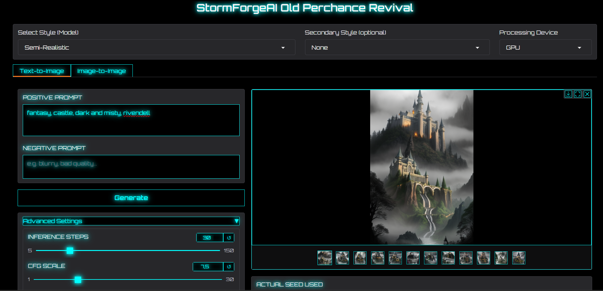

Perchance Revival - Easy Local SD 1.5 Image Generation
======================================================

   

Welcome to **Perchance Revival**! This is a user-friendly Gradio web application designed to bring back the experience of the old Perchance image generator by featuring the specific Stable Diffusion 1.5 models and common generation parameters/presets it used.

Generate images effortlessly and for free, directly on your own PC. This version is designed to **prioritize and utilize your NVIDIA GPU** for significantly faster generation if you have one, while still offering a CPU option for broader compatibility. The goal is to make local SD 1.5 generation as simple as possible, especially for those familiar with the old Perchance site.

Application Screenshot:
-----------------------

This project is primarily designed for **Windows** users, offering a straightforward setup with easy-to-use batch files. Manual setup options are also provided for other platforms or advanced users.

✨ What's New in This Version?
-----------------------------

This is the biggest update yet, adding a whole new way to create!

*   **Introducing Image-to-Image (img2img)!** A whole new tab has been added that lets you upload your own images and transform them with a prompt. Turn your doodles into masterpieces, change the style of a photo, or modify existing AI art.
    
*   **Dedicated Hires. fix Section:** Upscale and add significant detail to your creations with a simple, dedicated dropdown menu in the Text-to-Image tab.
    
*   **Increased Image Count:** You can now generate up to **12 images** in a single batch.
    
*   **Lossless PNG Output:** Images now save in **PNG format** by default.
    
*   **UI/UX Improvements:** The UI is now organized with clear tabs, and the image gallery thumbnails are smaller to save screen space.

*   Secondary Style dropdown selection with presets
    

#### Previous Updates

*   **✨ 01/08/2025:** More Perchance models and prompts tracked down. Development momentum is back!
    
*   **✨ 11/07/2025:** New realistic model - **CyberRealistic** - added.
    
*   **✨ 11/06/2025:** Enhanced Portability & Local Model Caching!
    
*   **Email model suggestions to:** [_raxephion@yahoo.com_](https://www.google.com/url?sa=E&q=mailto:raxephion@yahoo.com).
    

> ⚠️ **Early Development Notice**This app is still in **very early development**. It can already generate images successfully, but expect bugs and future changes.

How to Use the Image-to-Image (img2img) Tab
-------------------------------------------

Image-to-Image is a powerful way to use one of your own pictures as a starting point for a new creation.

1.  **Click the 'Image-to-Image' Tab:** Select the tab at the top of the interface.
    
2.  **Upload Your Image:** Drag and drop an image into the "Input Image" box.
    
3.  **Write a Prompt:** Describe what you want the _**final**_ image to look like.
    
4.  **Set the 'Strength' Slider:** This is the most important setting! It tells the AI how much to change your original image. A low strength (_0.1_ - _0.4_) makes small changes, while a high strength (_0.8_+) will only use your image as loose inspiration. A medium value is a great place to start.
    
5.  **Generate!** Click **'Generate from Image'** and see what you get!
    

How to Use Hires. fix (in Text-to-Image)
----------------------------------------

**Hires. fix** is a feature in the Text-to-Image tab that creates larger, more detailed images by generating a small image first and then intelligently upscaling it.

*   **To use it:** First, find a seed you like with your base settings. Then, open the **'Hires. fix'** menu, tick the checkbox to enable it, and adjust the **'Upscale by'** and **'Denoising strength'** sliders. Click generate again for a high-resolution result.
    

> **CPU Users Please Note:** Hires. fix is _very_ computationally intensive. It will be **extremely slow** on CPU-only systems. It is strongly recommended to only use this feature if you have a compatible GPU.

✨ Features
----------

*   **Text-to-Image Mode:** Generate art from a simple text description.
    
*   **Image-to-Image Mode:** Upload your own image and transform it with a prompt.
    
*   **Device Agnostic:** Run on your **CPU** or leverage your **NVIDIA GPU** for faster generation.
    
*   **Comprehensive Control:** Full control over prompts, steps, CFG scale, schedulers, and seeds.
    
*   **User-Friendly Interface:** A clean UI with organized tabs and controls.
    
*   **Safety First (Note):** The built-in safety checker is **disabled** to allow for maximum creative freedom. Please use responsibly.
    

⚡ Tips for CPU Users (Getting More Speed)
-----------------------------------------

Generating images on a CPU will always be slower than on a GPU, but you can significantly speed up the process by changing a few settings. If you find the wait times are too long, try these tips:

*   **Avoid Hires. fix:** As mentioned above, this feature performs a second, intensive pass and will drastically increase generation time on a CPU. It's best left disabled.
    
*   **Lower the Inference Steps:** The default is 30, but you can get surprisingly good results with fewer steps. Try starting with **15 steps**. With some models and schedulers, you can even get decent images at **10 steps**.
    
*   **Use a Fast Scheduler:** The **Euler** scheduler is generally one of the fastest available. Sticking with it is a good way to keep times down.
    
*   **Start with Smaller Images:** Generating a 512x512 image will be much faster than generating a 768x1024 one.
    
*   **Experiment!** The key is to find a balance between speed and quality that you are happy with. Try generating the same prompt with 10, 15, and 20 steps to see how much of a difference it makes for both the image quality and your wait time.
    

🚀 Prerequisites
----------------

*   **Windows Operating System:** The provided batch files (.bat) are for Windows.
    
*   **Python:** 3.8 or higher. You can download it from _python.org_.
    
*   **Hardware:**
    
    *   A modern CPU.
        
    *   For GPU speed, a compatible **NVIDIA GPU** with up-to-date CUDA drivers. At least **6–8GB VRAM** is recommended.
        
*   **Internet Connection:** Required for the initial download of models.
    

📦 Easy Setup (Windows - Download & Run)
----------------------------------------

1.  **Download:** Go to the GitHub page, click the green **< > Code** button, and select **"Download ZIP"**.
    
2.  **Extract:** Extract the file to a location on your computer.
    
3.  **Setup:** Run _setup-CPU.bat_ for CPU or _setup-GPU.bat_ for GPU.
    
4.  **Wait:** A command prompt will open and install everything. Please be patient.
    

🔄 Updating the Application (Windows - Easy Method)
---------------------------------------------------

To get the latest features, simply double-click **update.bat** in the project folder.

▶️ Running the Application (Windows - Easy Method)
--------------------------------------------------

Once setup is complete, just double-click the **run.bat** file. A browser window should automatically open with the app.

⚙️ Manual Setup (For Linux/macOS or Advanced Users)
---------------------------------------------------

1.  **Clone:** Run _git clone https://github.com/Raxephion/Old-Perchance-Revival-WebUI.git_ and then _cd Old-Perchance-Revival-WebUI_.
    
2.  **Create Environment:** Run _python -m venv venv_. Then activate it (_venv\\Scripts\\activate_ on Windows, _source venv/bin/activate_ on Linux/macOS).
    
3.  **Install Dependencies:** Run _pip install -r requirements.txt_.
    
4.  **Install PyTorch:** Find the correct command for your system at the **PyTorch website**.
    
5.  **Run:** Run _python main.py_.
    

⚙️ Uninstall:
-------------

*   Simply **delete the project folder**. This app is completely portable.
    

📄 License
----------

This project is licensed under the MIT License - see the **LICENSE** file for details.

Support:
--------

Feel free to buy me a coffee ;) [_https://ko-fi.com/raxephion_](https://www.google.com/url?sa=E&q=https://ko-fi.com/raxephion)
