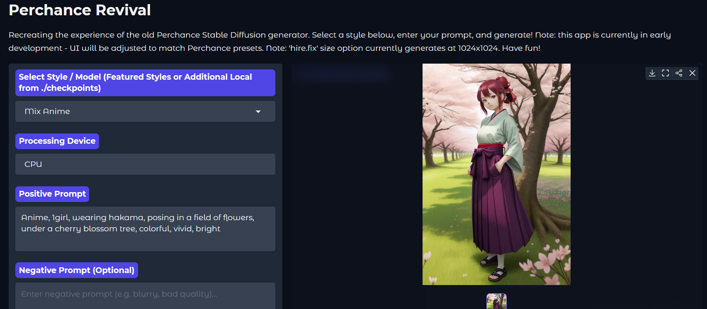

Perchance Revival - Easy Local SD 1.5 Image Generation
======================================================

Plain textANTLR4BashCC#CSSCoffeeScriptCMakeDartDjangoDockerEJSErlangGitGoGraphQLGroovyHTMLJavaJavaScriptJSONJSXKotlinLaTeXLessLuaMakefileMarkdownMATLABMarkupObjective-CPerlPHPPowerShell.propertiesProtocol BuffersPythonRRubySass (Sass)Sass (Scss)SchemeSQLShellSwiftSVGTSXTypeScriptWebAssemblyYAMLXML`      `

Welcome to **Perchance Revival**! This is a user-friendly Gradio web application designed to bring back the experience of the old Perchance image generator by featuring the specific Stable Diffusion 1.5 models and common generation parameters/presets it used.

Generate images effortlessly and for free, directly on your own PC. This version is designed to **prioritize and utilize your NVIDIA GPU** for significantly faster generation if you have one, while still offering a CPU option for broader compatibility. The goal is to make local SD 1.5 generation as simple as possible, especially for those familiar with the old Perchance site.

Application Screenshot:
-----------------------

Plain 
   `

This project is primarily designed for **Windows** users, offering a straightforward setup with easy-to-use batch files. Manual setup options are also provided for other platforms or advanced users.

✨ What's New in This Version?
-----------------------------

This latest release focuses on adding powerful new features and improving your quality of life!

*   **Dedicated Hires. fix Section:** The most exciting new feature! You can now upscale and add significant detail to your creations with a simple, dedicated dropdown menu. (See the full guide on how to use it below!)
    
*   **Increased Image Count:** You can now generate up to **9 images** in a single batch, making it easier to find that perfect result.
    
*   **Lossless PNG Output:** Images now save in **PNG format** by default for the best possible quality, with no compression artifacts.
    
*   **UI/UX Improvements:** The 'Generate' button has been moved to a more logical spot, right below the prompts, so you can access it without scrolling. The image gallery thumbnails are also smaller, allowing you to see more of your creations at once without cluttering the screen.
    

#### Previous Updates

*   **✨ 01/08/2025:** Managed to track down more perchance models, presets and system prompts. After being emailed by people using this app, and seeing there actually IS interest, I will up the momentum again with this. Pity about the toxicity on Reddit, but as long as the interest remains, this shall remain in active development.
    
*   **✨ 11/07/2025:** New realistic model - **CyberRealistic** - added.
    
*   **✨ 11/06/2025:** Enhanced Portability & Local Model Caching! All models are now downloaded and cached into the local checkpoints folder, making the app fully portable.
    
*   **Email model suggestions to:** [_raxephion@yahoo.com_](https://www.google.com/url?sa=E&q=mailto:raxephion@yahoo.com) (models you think might have been used by perchance and/or models you'd like to see in the app).
    

> ⚠️ **Early Development Notice**This app is still in **very early development**. It can already generate images successfully, but expect bugs, missing polish, and future changes. It’s functional but **not production-ready yet**.

How to Use the New Hires. fix Feature
-------------------------------------

Standard AI images can sometimes look a bit soft or lack fine detail at their base size (like 512x768). **Hires. fix** is a powerful feature that solves this by performing a two-step process to create larger, more detailed final images.

1.  It generates your image at the normal, smaller size you selected.
    
2.  It then intelligently enlarges that image and **paints over it** with more detail, using your original prompt as a guide.
    

The result is a high-resolution image that retains the composition you liked from the smaller version.

#### Simple Steps to Use Hires. fix:

1.  **Generate Your Base Image First:** Write your prompt and set your normal settings (steps, CFG, size) as you usually would. It's often a good idea to find a seed you like _before_ enabling Hires. fix. This saves you from wasting time upscaling an image you don't like.
    
2.  **Open the 'Hires. fix' Menu:** Click on the dropdown menu labeled **'Hires. fix'** located below the Advanced Settings.
    
3.  **Enable It:** Tick the **'Enable Hires. fix'** checkbox.
    
4.  **Configure the Settings:**
    
    *   **Upscale by:** This slider controls how much bigger the final image will be. A value of _1.5_ will make a 512x512 image into a 768x768 image. A value of _2.0_ will double it to 1024x1024.
        
    *   **Denoising strength:** Think of this as a "creativity vs. faithfulness" slider for the second step.
        
        *   A **lower value** (e.g., _0.5_) will stick very closely to your original image's composition and colors, just adding finer detail.
            
        *   A **higher value** (e.g., _0.75_) gives the AI more freedom to change things and add new elements while it adds detail. This can sometimes lead to better results, but may also alter your image more than you want. A good starting point is usually around **0.6-0.7**.
            
5.  **Click Generate!** Your PC will now perform both steps. Be patient, as this will take longer than a normal generation.
    

> **Important Note:** Hires. fix uses more of your computer's resources (VRAM) and takes longer because it's essentially doing twice the work. If you get an 'Out of Memory' error, try using a smaller 'Upscale by' value.

✨ Features
----------

*   **Device Agnostic:**
    
    *   Run inference on your **CPU**.
        
    *   Leverage your **NVIDIA GPU** for significantly faster generation.
        
*   **Comprehensive Control:**
    
    *   **Positive & Negative Prompts:** Guide the AI with detailed descriptions.
        
    *   **Inference Steps & CFG Scale:** Control image generation quality and prompt adherence.
        
    *   **Schedulers:** Experiment with different sampling algorithms (Euler, DPM++ 2M, DDPM, LMS).
        
    *   **Image Sizes:** Choose from standard SD1.5 resolutions.
        
    *   **Seed Control:** Set a specific seed for reproducible results or use -1 for a random one.
        
*   **User-Friendly Interface:**
    
    *   Clean and intuitive Gradio UI with organized controls.
        
    *   Direct image display with download and share options.
        
*   **Safety First (Note):** The built-in safety checker is **disabled** to allow for maximum creative freedom. Please use responsibly.
    

🚀 Prerequisites
----------------

*   **Windows Operating System:** The provided batch files (.bat) are for Windows.
    
*   **Python:** 3.8 or higher. You can download it from _python.org_.
    
*   **Hardware:**
    
    *   A modern CPU.
        
    *   For GPU speed, a compatible **NVIDIA GPU** with up-to-date CUDA drivers. At least **6–8GB VRAM** is recommended.
        
*   **Internet Connection:** Required for the initial download of models.
    

📦 Easy Setup (Windows - Download & Run)
----------------------------------------

This is the recommended and easiest method for most Windows users.

1.  **Download the project:**
    
    *   Go to the GitHub repository page.
        
    *   Click the green **< > Code** button and select **"Download ZIP"**.
        
2.  **Extract the ZIP:** Extract the file to a location on your computer (e.g., your Desktop).
    
3.  **Choose Your Setup Script:**
    
    *   For **CPU** Inference: Run _setup-CPU.bat_.
        
    *   For **GPU** Inference: Run _setup-GPU.bat_.
        
4.  **Run the Setup Script:**
    
    *   **Double-click the script you chose**. A command prompt window will open and automatically install everything you need. Please be patient, as this can take some time.
        

🔄 Updating the Application (Windows - Easy Method)
---------------------------------------------------

To get the latest features, simply double-click **update.bat** in the project folder. It will automatically download the latest changes for you.

▶️ Running the Application (Windows - Easy Method)
--------------------------------------------------

Once setup is complete, just double-click the **run.bat** file. A command prompt will appear, and a browser window should automatically open with the app. If not, open the URL shown in the console (usually _http://127.0.0.1:7860_).

⚙️ Manual Setup (For Linux/macOS or Advanced Users)
---------------------------------------------------

If you are not on Windows or prefer a manual approach:

1.  **Clone the Repository:**Open your terminal, navigate to where you want the project, and run the command: _git clone https://github.com/Raxephion/Old-Perchance-Revival-WebUI.git_. Then, navigate into the new folder with: _cd Old-Perchance-Revival-WebUI_.
    
2.  **Create and Activate a Virtual Environment:**First, run _python -m venv venv_.To activate it on Windows, run _venv\\Scripts\\activate_. On Linux/macOS, run _source venv/bin/activate_.
    
3.  **Install Dependencies:**Run the command: _pip install -r requirements.txt_.
    
4.  **Install PyTorch:** Find the correct command for your specific system (CPU or a certain CUDA version) at the official **PyTorch website**.
    
5.  **Run the Application:**With your virtual environment still active, run: _python main.py_.
    

⚙️ Uninstall:
-------------

*   Simply **delete the project folder**. This app is completely portable and doesn't install anything outside its own directory.
    

📄 License
----------

This project is licensed under the MIT License - see the **LICENSE** file for details.

Support:
--------

Feel free to buy me a coffee ;) [_https://ko-fi.com/raxephion_](https://www.google.com/url?sa=E&q=https://ko-fi.com/raxephion)
